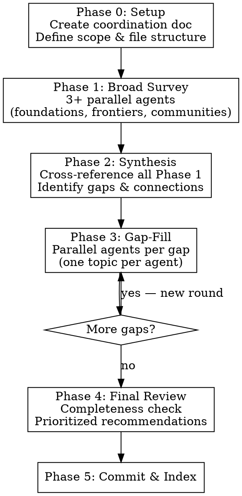

# Deep Research

## Overview

Multi-phase research methodology that uses parallel agents with file-based persistence to build comprehensive domain expertise. Each phase narrows focus: broad survey → synthesis → targeted gap-fill → final review.

**Core principle:** Research is recursive. Survey first, synthesize to find gaps, fill gaps, re-synthesize. Stop when diminishing returns.

## When to Use

- User asks to "deeply research", "become an expert in", or "gather all sources on" a topic
- Any knowledge acquisition task spanning multiple sub-domains
- Building a reference corpus for future use
- When NOT to use: simple fact-finding, single-question lookup, reading a known document

## Process



## Phase 0: Setup

Create a coordination document (`research/README.md` or equivalent) at the start:

```markdown
# [Topic] Research

## Phase Tracker
| Phase | Status | Files |
| ----- | ------ | ----- |
| 1     | ...    | ...   |

## File Index
| File | Lines | Topic | Phase |

## Agent Guidance
[See below]
```

Define the output directory and file naming convention before launching any agents.

## Phase 1: Broad Survey (Parallel)

Launch 3+ agents simultaneously, each covering a different axis:

| Agent | Focus | Output |
| ----- | ----- | ------ |
| Foundations | Canon texts, essential reading, hard problems, established theory | `knowledge-base.md` |
| Frontiers | Recent papers (last 5 years), new methods, ML/AI approaches, emerging tools | `cutting-edge-papers.md` |
| Communities | Forums, blogs, open-source projects, active discussions, indexing value rankings | `communities.md` |

Additional axes as needed: tooling, standards bodies, industry practice, education resources.

## Phase 2: Synthesis

**Single agent** reads ALL Phase 1 files and produces:

1. **Coverage map** — what's well-covered vs. missing
2. **Foundation → Frontier links** — which classic problems have new solutions
3. **Heat map** — hot (active research), warm (steady progress), cold (stalled/ignored)
4. **Gap list** — specific topics needing deeper research, with search terms
5. **Unexpected connections** — cross-domain insights not in the original scope
6. **Practical priorities** — ranked by value for the user's actual project

## Phase 3: Gap-Fill (Parallel, Recursive)

For each gap identified in synthesis, launch a targeted agent:

- **One topic per agent** — never combine unrelated gaps
- Each agent reads the synthesis first to understand context
- Each agent writes to its own file: `gap-fill-{topic}.md`
- Run multiple rounds if synthesis of gap-fills reveals new gaps
- Typically 2-3 rounds suffice before diminishing returns

## Phase 4: Final Review

Single agent reads ALL files and produces:

- Completeness assessment (every topic rated)
- Finalized rankings (forums, resources, tools)
- Unexpected directions worth pursuing
- Practical takeaways for the user's project
- Remaining gaps (if any) for future research
- Master reference index

## Phase 5: Commit & Index

- Commit all research files
- Update any project knowledge bases or indexes
- Index in statement-mcp or equivalent if available

## Agent Guidance Rules

**Every research agent MUST follow these rules.** Include them in agent prompts:

1. **Write to files before returning.** All research output goes to the designated file. Never return large research results only as inline text.

2. **Read existing work first.** Before starting, read the coordination doc and any files from prior phases to avoid duplication.

3. **One topic per agent.** Stay focused. If you discover a tangential topic worth researching, note it as a gap for a future agent — don't chase it.

4. **Cap output at ~300 lines.** If a topic needs more, split into sub-topics for separate agents. Dense, referenced content beats sprawling prose.

5. **Summarize, don't transcribe.** Distill insights. Cite sources by author/year/title. Don't reproduce large passages.

6. **Note gaps explicitly.** End each file with a "Gaps & Further Research" section listing what you couldn't cover.

7. **Use consistent structure.** Every file should have: title, overview paragraph, organized sections with headers, citations, gaps section.

8. **Stop and write if running low on context.** If you sense you're approaching context limits, write what you have to the file immediately rather than risk losing work.

9. **Update the phase tracker.** After writing your file, update the coordination doc's phase tracker and file index.

## Prompt Templates

### Phase 1 Agent (Foundations)

```
Research the foundational knowledge for [TOPIC]. Cover:
- Essential textbooks and their key contributions
- Hard/unsolved problems and why they're hard
- Established algorithms and data structures
- Key online resources and courses
- Recommended reading paths (beginner → expert)

Write output to [PATH]. Max ~300 lines. Read [COORDINATION_DOC] first.
Cite sources as: Author (Year) "Title".
End with a Gaps section noting what you couldn't cover.
```

### Phase 1 Agent (Frontiers)

```
Research cutting-edge work (last 5 years) in [TOPIC]. Cover:
- Recent papers with novel methods (cite: Author, Year, Title, Venue)
- ML/AI approaches to classical problems
- Key research labs and groups
- Available datasets and benchmarks
- Emerging directions and open problems

Write output to [PATH]. Max ~300 lines. Read [COORDINATION_DOC] first.
End with a Gaps section.
```

### Phase 1 Agent (Communities)

```
Research active communities and forums for [TOPIC]. For each, provide:
- Name, URL, estimated size/activity
- Key topics discussed
- Value rating (1-10) for indexing/scraping
- Indexing difficulty (easy/medium/hard)
- Notable contributors or recurring experts

Also cover: blogs, open-source projects with good docs, Stack Exchange tags,
Discord/Slack communities, YouTube channels, podcasts.

Write output to [PATH]. Max ~300 lines. Read [COORDINATION_DOC] first.
End with a recommended indexing priority list.
```

### Phase 2 Agent (Synthesis)

```
You are synthesizing a multi-phase research project. Read ALL of these files:
[LIST OF ALL PHASE 1 FILES]

Then write a synthesis document to [PATH] covering:
1. Coverage map — rate each sub-topic: Well Covered / Partial / Gap
2. Foundation → Frontier mapping — which classic problems have new solutions
3. Heat map — Hot (active research) / Warm (steady) / Cold (stalled)
4. Gap list — specific topics needing Phase 3 research, with search terms
5. Unexpected connections across sub-domains
6. Practical priorities ranked by value for [USER'S PROJECT CONTEXT]

Max ~200 lines. Be analytical, not just summarizing.
```

### Phase 3 Agent (Gap-Fill)

```
Deep-dive research on [SPECIFIC GAP TOPIC].

Context: Read [SYNTHESIS_FILE] to understand why this gap was identified.
Also read [COORDINATION_DOC] for existing coverage.

Cover:
- Current state of the art
- Key papers and tools
- Practical implications for [USER'S PROJECT]
- What's still missing or unsolved

Write output to [PATH]. Max ~300 lines.
End with a Gaps section.
```

## Adapting Scope

| Research scope | Phases | Agents | Est. output |
| -------------- | ------ | ------ | ----------- |
| Narrow topic   | 1-2-4  | 3-5    | ~1,000 lines |
| Medium domain  | 0-1-2-3-4 | 8-12 | ~2,500 lines |
| Broad field    | 0-1-2-3-3-4 | 15-20 | ~4,000+ lines |

For narrow topics, skip Phase 0 (no coordination doc needed) and Phase 3 (synthesis IS the final output).

## Common Mistakes

| Mistake | Fix |
| ------- | --- |
| Agent returns research inline, never writes file | Always specify output file path in prompt |
| Agents duplicate each other's work | Coordination doc + "read existing work first" rule |
| Single agent tries to cover everything | Split into focused parallel agents |
| Research sprawls without synthesis | Always do Phase 2 before Phase 3 |
| Gap-fill creates more gaps infinitely | Cap at 2-3 rounds; accept diminishing returns |
| Agent overflows context mid-research | ~300 line cap + "stop and write" rule |
| No practical takeaways | Always tie back to user's actual project/goals |
